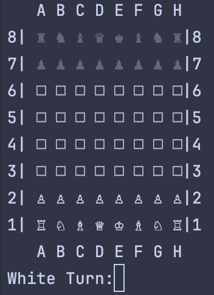
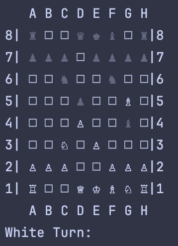
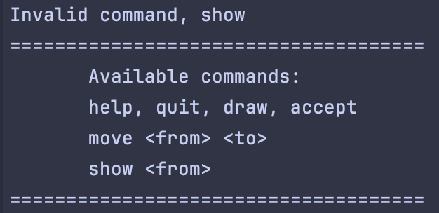
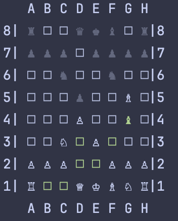

# ChessGame

Welcome to **ChessGame**, a Rust-based implementation of a chess game! This project is designed to provide a simple and extensible chess game engine with a focus on clean, modular design and adherence to Rust best practices.

## Features

- **Interactive Command Line Interface**: Play chess using simple text commands with an intuitive interface.
- **Move Highlighting**: See available moves for a selected piece.
- **Command Help**: Receive guidance on available commands during gameplay.
- **Checkmate Detection**: Automatically detects when a game is over due to checkmate.
- **Extensibility**: Add or modify game rules easily using the clean code structure.

## Gameplay Screenshots

### Starting Board


### Making a Move


### Available Commands Help


### Show Available Moves



## How to Play

1. Run the game using the provided Rust executable:
   ```bash
   cargo run